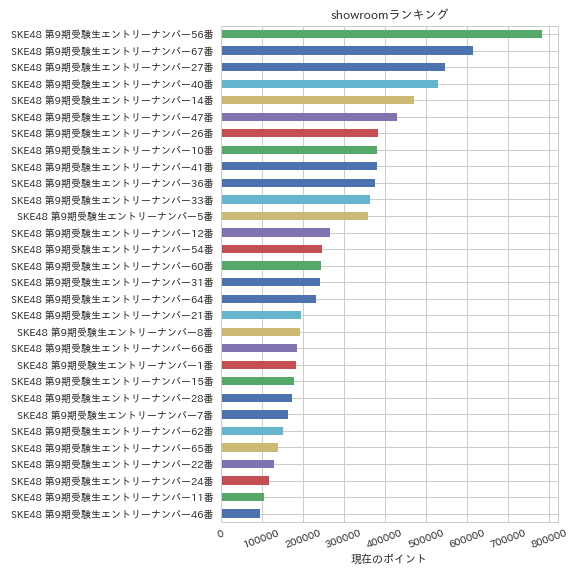

# Showroom Event Ranking Score
showroomのオーディションの獲得ポイントを取得する。
ランキング形式で競うイベントのみ(レベル形式のイベントでは使用できない)。

## 使い方
2018/11/27-2018/12/05に開催された
[SKE48 第9期生オーディション SHOWROOM部門 - SHOWROOM(ショールーム)](https://www.showroom-live.com/event/ske48_9th_audition)
にて、開催期間中に以下のコードを実行すると、ランキングの獲得ポイントのグラフを画像で保存する。

    from get_event_ranking import request_ranking_info
    event_page_url = "https://www.showroom-live.com/event/ske48_9th_audition"
    df = request_ranking_info(event_page_url)
    df.sort_values("current_score", ascending=True).plot(x="room_name", y="current_score", kind="barh", legend=None, figsize=(8, 8))
    plt.xticks(rotation=20)
    plt.title('showroomランキング')
    _ = plt.xlabel("現在のポイント")
    _ = plt.ylabel("")
    plt.tight_layout()
    plt.savefig("temp.png")
    plt.close()

これで、次のような画像を得る。

他のイベントでも、`event_page_url = "https://www.showroom-live.com/event/ske48_9th_audition"の部分をイベントurlに変更することで使用できる。`